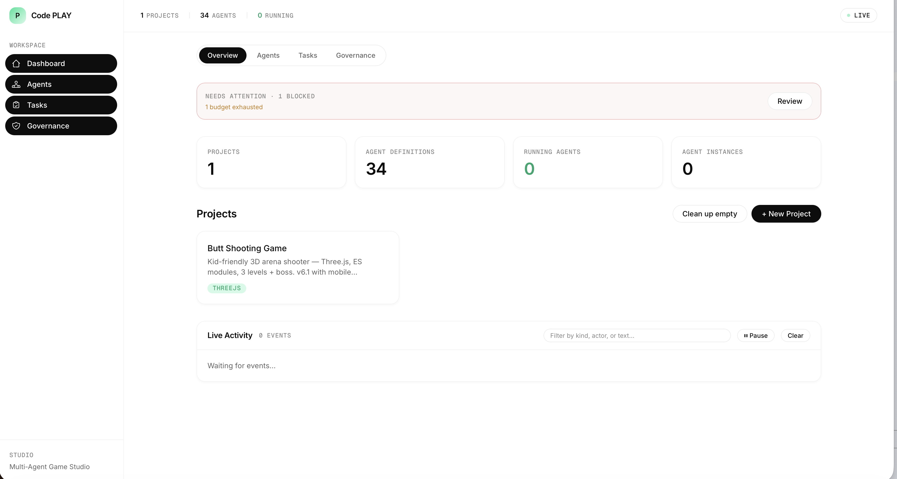

# Code PLAY

An AI game studio where 35 specialized agents collaborate to build, playtest, and ship kid-friendly web and Roblox games — from a one-line brief to a live itch.io URL.

Not a framework. A studio. You describe a game, agents design it, build it, QA it, and publish it. You make the creative calls at human gates. They do the rest.



## How it works

```
"a butt-themed shooter where you dodge enemies and collect power-ups"
    │
    ▼
┌─────────────────────────────────────────────────────────┐
│  phased-producer pipeline (22 steps, human-gated)       │
│                                                         │
│  concept ── mechanics ── style research ── look & feel  │
│      │          │              │                │       │
│      ▼          ▼              ▼                ▼       │
│  [gate]     [gate]                          [gate]      │
│                                                         │
│  tech plan ── build ── telemetry ── QA playtest         │
│      │          │          │            │               │
│      ▼          ▼          ▼            ▼               │
│  [gate]    game_html_v1  instrumented  [gate]           │
│                                                         │
│  code review ── scaffold iteration ── publish prep      │
│                                            │            │
│                                            ▼            │
│                                        [gate] ── ship   │
└─────────────────────────────────────────────────────────┘
    │
    ▼
🎪 Live on itch.io — then iterate via playtest bot loop
```

Every `[gate]` is a moment where you review, approve, or redirect. Between gates, agents work autonomously.

## Shipped games

| Title | Codename | Live URL |
|-------|----------|----------|
| Cheekshot | butt-shooting-game v3 | [itch.io](https://linnana8888888.itch.io/cheekshot) |
| Roblox Smoke Test | roblox-smoke-test v1 | [Roblox](https://www.roblox.com/games/126715565755517) (private) |

## The agents

35 agents across 8 disciplines, each with a focused role and its own model routing:

| Discipline | Agents | What they do |
|-----------|--------|-------------|
| **Game Dev** | game-designer, game-audio-engineer, technical-artist, 3 roblox specialists | Mechanics, audio, art direction, Roblox Luau |
| **Design** | hud-designer, screen-flow-designer, player-researcher, juice-polisher, ux-designer | HUD layout, state machines, trend research, polish passes |
| **Engineering** | frontend-developer, code-reviewer, tech-lead, rapid-prototyper, gameplay-programmer, 5 Unity specialists | Web builds (Three.js/canvas), Unity C#, code review, tech plans |
| **Leadership** | creative-director, technical-director | Vision guardrails, architecture ownership |
| **Production** | producer, publisher | Pipeline driver, itch.io/GH Pages/Roblox shipping |
| **Testing** | qa-engineer, game-performance-tester, game-release-gate, **kid-safety-reviewer** | Headless playtests, perf budgets, ship/no-ship gate, kid-safety checks |
| **Analytics** | telemetry-engineer, metrics-dashboard-builder, analytics-reporter, player-feedback-synthesizer | Instrumentation, dashboards, postmortems, comment digests |
| **Research** | style-researcher, mechanic-researcher | Visual references, mechanic teardowns |

Agents route through **Anthropic** (Claude Opus/Sonnet/Haiku), **OpenAI** (GPT-5 via LEGO proxy), and **oMLX** (local Qwen/Gemma — text-only tasks) with automatic fallback chains. Each agent gets scoped tools (lean `core` tier + role-specific extras) and curated skills (brainstorming for designers, TDD for devs, data-viz for analytics, etc.).

## Pipelines

| Pipeline | Purpose |
|----------|---------|
| `phased-producer` | Full game production: concept to live URL with human gates at every phase |
| `iterate_artifact` | Cyclic improvement loop: playtest bot runs 5x → postmortem → 4 parallel proposals → you pick → implement → repeat |

## The iteration loop

After a game ships, `iterate_artifact` takes over. A headless playtest bot (`playtest_bot.mjs`) drives the game through `window.GameAPI`, collects telemetry, and feeds it into a cyclic pipeline:

1. **Generate bot** — QA engineer reads game source, writes a game-specific bot (not a random walk)
2. **Playtest** — bot runs 5x, writes telemetry JSON
3. **Postmortem** — analytics-reporter grades each GOALS.md target (hit/miss)
4. **Propose** — 4 agents in parallel (designer, UX, artist, prototyper) each pitch 5-8 ideas
5. **Human picks** — you select which ideas to implement
6. **Budget estimate** — tech-lead forecasts token cost and proposes engineer split
7. **Implement** — frontend-developer applies changes (single or parallel engineers)
8. **Loop** — back to playtest with the new build

The bot and game communicate through a standardized `window.GameAPI` contract (start, getState, getSnapshot, pickCard) so one bot drives any game. On cycle 1, the QA engineer generates a game-specific bot using entity screen coordinates from `getSnapshot()`. On subsequent cycles, the existing bot is reused or tuned.

## Architecture

```
FastAPI orchestrator (Python)
├── Agent Runtime ─── model-agnostic tool-use loop, budget enforcement, session persistence
├── LLM Router ────── Anthropic / OpenAI / oMLX with fallback chains
├── Tool Executor ──── 2-tier governance (core 19 tools / builtin 35), MCP bridge, mcp:<server> prefix filtering
├── Task Queue ────── SQLite-backed, dependency resolution, atomic checkout
├── Pipeline Engine ── declarative YAML pipelines with human gates
├── Project Memory ── per-game SQLite store (artifacts, decisions, feedback)
├── Skill Registry ── 445 available skills, role-curated injection (18 agents get 1-4 skills each)
├── Path Rules ────── auto-inject domain rules when agents touch matching files
├── Artifact Templates ─ 16 structured output templates across 9 categories
└── React Dashboard ── real-time observability, Kanban board, governance approvals
```

## Quick start

```bash
# Backend
python3 -m venv .venv && source .venv/bin/activate
pip install -r requirements.txt
cp .env.example .env   # add your API keys
python3 -m uvicorn src.main:app --port 8080

# Dashboard (dev)
cd dashboard && npm install && npm run dev
```

- Dashboard: http://localhost:8080/app
- API docs: http://localhost:8080/docs
- 70 REST endpoints + WebSocket feed

## Game index

Games live in `games/*.yaml` — each file tracks the source repo, version history, and publish status:

```yaml
slug: butt-shooting-game
title: Butt Shooting Game
source:
  kind: external
  repo: https://github.com/linnana8888888/butt-shooting-game
versions:
  - label: v3
    ref: c1fa6d8
    status: shipped
    shipped_as: Cheekshot
    published:
      itch: https://linnana8888888.itch.io/cheekshot
```

## Project structure

```
code-play/
├── agents/          # 34 agent definitions (.md) across 8 disciplines
├── artifacts/       # Per-game build artifacts, publish assets, project state
├── config/
│   ├── agents.yaml      # Model routing, scoped tools + skills, budgets per agent
│   ├── governance.yaml  # Tool tiers: core (19), builtin (35), restricted, blocked
│   ├── pipelines.yaml   # 6 declarative pipelines
│   ├── path_rules.yaml  # Auto-injected domain rules
│   └── artifact_templates.yaml
├── dashboard/       # React + Vite + Tailwind — real-time studio UI
├── docs/            # Design doc, iteration contract, session logs
├── games/           # Game index (YAML per game, version + publish tracking)
├── skills/          # Injectable knowledge (.md) — asset sources, coding standards
├── src/
│   ├── main.py              # FastAPI app (70 endpoints)
│   ├── runtime/             # Agent runtime, LLM router, tool executor, MCP bridge
│   ├── orchestrator/        # Registry, task queue, pipeline engine
│   ├── iteration/           # Scaffolder, bootstrap, contract validation
│   └── models/              # Pydantic models
├── templates/       # 16 artifact output templates (concept, design, QA, publish...)
└── tests/           # Integration + unit tests
```

## Quality gates

Every artifact written to project memory is validated against `config/artifact_schemas.yaml` — required fields are checked at write time, with warnings logged for missing structure.

The **Creative Director** agent issues APPROVE / CONCERNS / REJECT verdicts after every concept, mechanics, and look-and-feel phase. A REJECT automatically re-queues the upstream agent (max 2 retries before escalating to a human gate).

The **playtest bot** acts as a hard gate: if average session length < 90s or level-1 death rate > 3/min, the build is automatically sent back for revision without requiring human review.

A **kid-safety-reviewer** agent (Claude Haiku) runs before the LAF and QA human gates, checking every build against a 7-point checklist for ages 9-12 (violence, controls, readability, humor tone, session length, difficulty, language).

## Tests

```bash
# Unit + integration tests
python3 -m pytest tests/ -v

# Live integration tests (requires running service)
CODE_PLAY_URL=http://localhost:8080 python3 -m pytest tests/test_integration_live.py -v
```

**Test health (phase1-improvements):** 308 passing, 2 pre-existing failures (aspirational TDD for unbuilt features), 0 regressions.

## Changelog

### phase1-improvements (2026-04-25)
- **Artifact schema validation** — `config/artifact_schemas.yaml` defines required fields for all 11 memory artifact keys; `task_validator.py` warns on malformed writes
- **CD verdict enforcement** — Creative Director REJECT now re-queues upstream agent (max 2 retries → human escalation)
- **Playtest hard gate** — auto-REVISE if session < 90s or death rate > 3/min in level 1
- **Kid-safety-reviewer agent** — Haiku-powered 7-point safety check before LAF and QA gates
- **Model routing fix** — oMLX removed from fallback chains for all tool-use agents; replaced with Claude Haiku
- **Bug fix** — `workspace.py` git worktree cleanup fallback now runs correctly on git failure
- **+24 live integration tests** covering Phase 1 wiring end-to-end

## License

Private repository.
